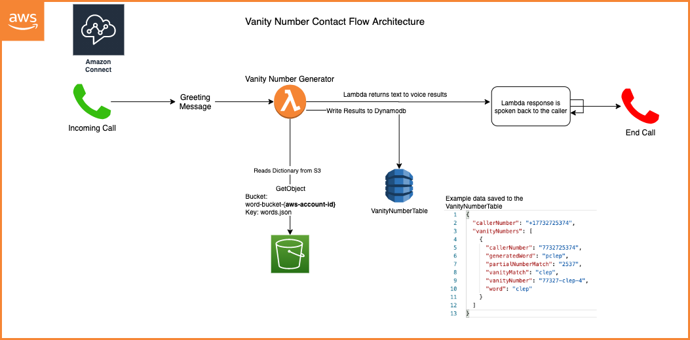
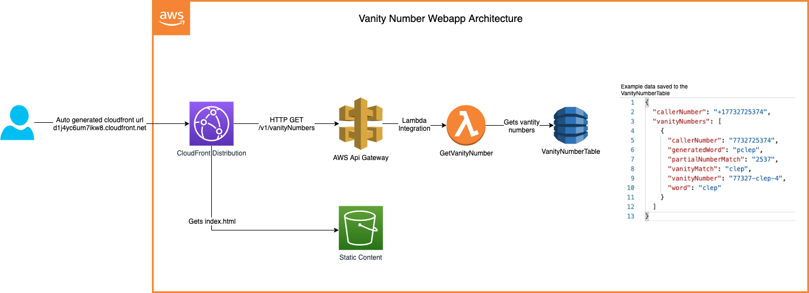
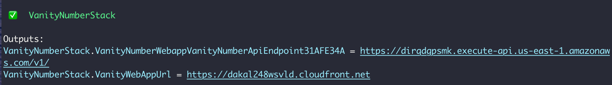

# Vanity Number Generator

The vanity number generator is an Amazon Connect contact flow and serverless application.
The contact flow will allow the user to call a number to hear three of the generated results.
The webapp will allow the user to see the top five vanity numbers generated.

### Table of Contents

[High Level Architecture](#high-level-architecture)

[Algorithm Generating Vanity Numbers](#algorithm-generating-vanity-numbers)

[Installation to an AWS Account](#installation-to-an-aws-account)

[Useful commands](#useful-commands)

[Production shortcuts and improvements](production-shortcuts-and-improvements)

[Implementation with more time](implementation-with-more-time)

## Try it out yourself!
Call the phone number: 619-866-0474

View results on the website: https://dakal248wsvld.cloudfront.net


### High Level Architecture
### Vanity Number Contact Flow Architecture


### Vanity Number Webapp Architecture


### Algorithm Generating Vanity Numbers
Amazon Connect lambda integrations can only run for a maximum of 8 seconds.
The initial implementation execution time was greater than 30 seconds requiring optimizations.
The initial implementation used a backtracking algorithm (reference: https://www.geeksforgeeks.org/find-possible-words-phone-digits/)
The backtracking algorithm has an exponential time complexity O(4^n).

#### Optimization to get execution time under 8 seconds:
##### 1. Reduce Dictionary Size
All words from the dictionary greater than 5 and less than 2 were removed from the dictionary.
Roughly reducing the size of the possible matches by ~50%.

##### 2. Reduce Number of Permutations
The permise behind this logic is the low probability for finding a match on words greater than 5.
The optimization calculates the permutations of 5 numbers instead of 10.

Generating all permutuations for the 10 digit phone number would be 10! = 3,628,800 total permutations.
The phone number is split into 5 chunks of 5 reducing the total permutations to 5! * 5 = 600 (way better than 10!)

Example: Phone number 773-272-5374 =>   
```
[ '7', '7', '3', '2', '7' ],
[ '7', '3', '2', '7', '2' ],
[ '3', '2', '7', '2', '5' ],
[ '2', '7', '2', '5', '3' ],
[ '7', '2', '5', '3', '7' ],
[ '2', '5', '3', '7', '4' ]
```

##### 3. Asynchronous Code
This optimization is to process all the chunks asynchronously further increasing performance.
Javascript makes integrating asynchronous code seemless.
```
const promises = chunks.map(async (chunk) => permutateString(...));

await Promise.all(promises);
```

These three optimization reduced the total execution time from 30s to less than 4s.

## Installation to an AWS Account
* Node Version 12x or greater
* NPM - Node Package Manager
* CDK Version 1.70.0

#### Prerequisites
CDK Install:

```
$ npm install -g aws-cdk@1.70.0
```

The target AWS Account must be bootstrapped to deploy CDK:

```
$ cdk bootstrap aws://[YOUR-AWS-ACCOUNT-NUMBER]/[YOUR-DESIRED-REGION]
```

Example: `$ cdk bootstrap aws://1234567890/us-east-1`

#### Deploy
Download deployment package: https://vanity-number-package.s3.amazonaws.com/vanity-number-package.zip

Mac: `cd ~/Downloads` 

Deploy the application
```
$ cdk deploy --app vanity-number-package --parameters 'AwsConnectInstanceId=YOUR-AMAZON-CONNECT-INSTANCE-ARN'
```

Example:
```
$ cdk deploy --app vanity-number-package --parameters 'AwsConnectInstanceId=arn:aws:connect:us-east-1:1234567890:instance/283d6dde-ab63-4385-adca-a167f089d751'
```

The output will have the webapp url `VanityNumberStack.VanityWebappUrl`. The Url can also be found in the Cloudformation Outputs from the AWS console.



## Useful commands

 * `npm run build`        webpacks (bundling/minification) the frontend and backend
 * `npm run test`         perform the jest unit tests
 * `cdk deploy`           deploy this stack to your default AWS account/region
 * `cdk diff`             compare deployed stack with current state
 * `cdk synth`            emits the synthesized CloudFormation template


### Production shortcuts and improvements 
* Overall the security needs more attention. Website is accessible without any authentication or authorization.
* More thorough testing of edge cases
* Find the optimal memory setting for the lambda function
* Sanitize data; There are inappropriate words in the dictionary
* Implement rate limiting on the number of times a user can call

### Implementation with more time
* CICD pipeline
* Find a better solution for packaging a CDK application
* Create higher level constructs for AWS Connect
* Increase unit test coverage
* Functional test
* Route 53 DNS
* Monitoring with Cloudwatch Alarms
* Add definitions for all the words
* Language support
